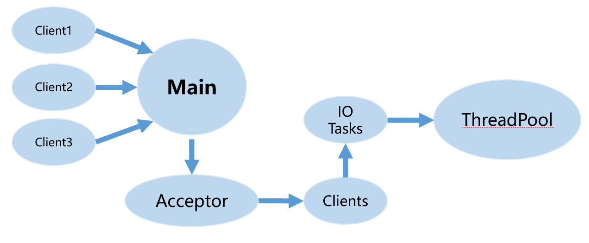
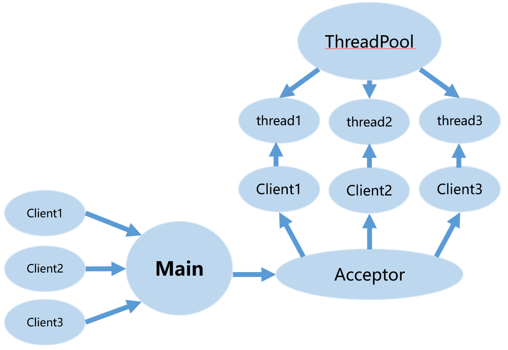
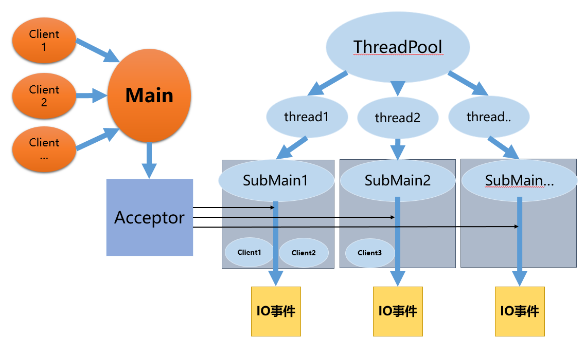

# Http服务器

## Introduction

本项目实现了一个基于Reactor模式的Web服务器, 支持Http长连接，可响应Get请求

## Enviroment

- OS: Ubuntu 16.04
- Complier: g++ 5.4.0
- Tools: CMake/VScode

## Technical points

* 基于Reactor模式构建网络服务器，编程风格偏向面向过程
* 采用非阻塞IO，IO复用模式默认是ET，可在编译前通过指定参数切换为LT模式，通过编译期确定工作模式，可以减少运行期不断判断条件造成的负担
* 线程间的工作模式: 主线程负责Accept请求，然后采用Round-bin分发的方式异步调用其他线程去管理请求端的IO事件
* 采用智能指针管理对象的资源
* 实现LockFreeQueue用于任务的异步添加与移除，代替了常规的互斥锁管理临界区的方式
* ......

## Develop and Fix List

* 2019-12-19 Dev: 基本框架的实现
* 2020-0304 Dev: 临界区的保护机制增加自旋锁，用于与互斥锁做性能对比
* 2020-03-14 Dev: 实现了Epoll ET模式 循环处理Accept、Read和Write事件
* 2020-03-26 Dev: 定义宏使得WebServer编译时确定Epoll的工作模式(ET/LT)
* 2020-0404 Important Dev: 临界区的保护机制增加了Lockfree queue，用于与互斥锁做性能对比

## Todo list

* 压力测试(LT模式与ET模式对比，异步唤醒临界区争用性能对比)，补补压力测试理论知识
* 查查负载均衡模式，与round-bin作对比

## Model development

### Http version 1

对于每一个http请求(client)，会有一个fd去处理，v1版本的做法是，每当请求client到达时(即epoll检测到活动事件时)，将此活动fd的任务转交给线程池中的线程去处理

版本一的框架如下图所示：



### Http version 2

这里每次有新任务到达时，就将新任务转交给线程，然后把程序的控制权转交到Epoll上，但是当在高并发状态，连接数太高，就会有很多活动的事件fd, 这是频繁的转交线程也会造成很大的开销

所以Version的初步设想是，每当有一个client到达时，利用线程池中的线程去负责这个client的fd, 然后由主线程中的epoll去通知这个线程何时开始处理任务，这样单个线程就可长期监视一个fd, 主线程就不用像Version 1一样，需要频繁地分配任务

> Note: 主线程应该如何通知单个线程要开始处理任务了呢？
>
> 1. 也就是采用线程间的通信方式（临界区、信号量、事件信号、互斥量）
> 2. 采用eventfd 的可读事件作为线程间的唤醒机制（类似于无名管道）

由此，初步设想已经完成，但是细想发现又不是很现实，比如，一个线程去负责一个client，那在高并发状态下，这是不可能完成的任务，

简单想一想，让一个线程负责多个文件描述符很简单，用一个map维护即可，这样就可让单个线程 负责 多个文件描述符

此时的框架图如下图所示：



但是直接这样就 单个线程负责多个文件描述符 是不现实的，比如，A线程负责了 a3和a4两个文件描述符，如果主线程应该如何通知 A线程 去处理 a3和a4两个活动fd呢，这里虽然可以想办法实现（将发生活动事件的fd 作为数据写入eventfd，然后再唤醒线程），但是有没有更好的办法呢。

进一步的思考时 如何让单个线程彻头彻尾的负责多个文件描述符，彻尾很简单，负责文件描述符的close即可。彻头就是要去负责监视文件描述符的活动事件，也就是由主线程通知A线程，你应该负责a3 这个文件描述符，A线程中也应该创建epoll对象，将a3需要监听的事件加入进来。往后，可继续添加多个文件描述符。 其实这一步相当于对之前的思路做了一个调整，之前是想让主线程去监听所有事件，现在主线程只负责accept请求，然后将accept的对象的控制权转交给其余线程，至此，版本二的设想已经基本完成

版本二的基本框架如下图所示：



为了简化处理，接下来的版本V2_1 将完成单线程的http server

和多线程的http server相比，区别主要在与单线程的Server在Acceptor后并不会转交给其他线程，而是在主线程内添加需要监视的文件描述符，所以在完成单线程server的基础上，只要加上 “转交” 的代码即可修改成多线程的server

单线程Server(v2_0)的主要代码可见v2_0 分支，接下来的 Server(v2_1)主要基于v2_0修改，v2_0已经是一个很基础的单线程http server了。

#### version 2_1 (单线程)

在版本v2_0中，代码太过于集中，不利于维护和修改，因此才有了版本v2_1，本版本借鉴了muduo完成

V2_1 打算新建一个Epoll类用于 IO复用，一个Acceptor用于建立新连接，TcpConnection用于管理接收到的连接，同时建立一个TcpServer，用于管理Acceptor和TcpConnection

对于每一个文件描述符，这里按照muduo的思路，新建了一个Channel类来管理 IO事件，然后用一个EventLoop对象来管理整个程序

``````cpp
// loop对象的主要代码   
while (!quit_)
    {
        activeChannels_.clear();
        pollReturnTime_ = poller_->poll(kPollTimeMs, &activeChannels_);
        for (auto it = activeChannels_.begin(); it != activeChannels_.end(); ++it)
        {
            (*it)->handleEvent(pollReturnTime_);
        }
    	//  在单线程server中, 直接用上面的handleEvent 是不能处理所有的任务回调的， 比如无法处理 Channel的析构，所以析构要在下面的doPendingFunctors中处理
        doPendingFunctors();
    }
``````

EventLoop是最主要的，用来管理整个IO事件，同时所有的事件回调，对象的析构都在loop中完成。

EventLoop主要提供两个接口用来处理事件的回调，`runInLoop`和`queueInLoop`, 这两个函数是必须的，缺一不可。首先，queueInLoop是必须的，负责对象的析构，而且其调用时间点是固定的，在上面的代码段的`doPendingFunctors()`这里，然而，应该如何完成IO事件的回调呢，queueInLoop虽然可行，但是会回调却不是同步进行的，先看一下IO事件的回调的调用时间点`(*it)->handleEvent(pollReturnTime_)`，由此为了让IO事件同步进行，所以添加了runInLoop这个新函数，同时，runInLoop的调用还可以发生在启用loop循环之前，可用于设置EventLoop用于管理的对象

``````cpp
// 这个函数可以在loop启动之前调用的，用于设置channel或者绑定IO事件等，例如套接字的监听
void EventLoop::runInLoop(const Functor &cb)
{
    cb();
}

// 
void EventLoop::queueInLoop(const Functor &cb)
{
    pendingFunctors_.push_back(cb);
}
``````

至此，单线程的http server已经完成

### master (多线程)

此版本在单线程server的基础上，添加线程间通信便可以实现多线程server

具体方案是：利用互斥锁管理EventLoop的functors，同时利用Eventfd实现了线程的异步唤醒，这样就可以轻松的跨线程调配任务

``````cpp
// 添加了下面的函数用于判断是否是同一个线程
bool isInLocalThread() const
{
    return this->threadId_ = std::this_thread::get_id();
}
``````

关于异步唤醒机制，见下面代码段

wakeup主要是触发可读事件，那么就可以唤醒 某个正阻塞在Epoll的线程

``````cpp
if(isInLocalThread == false)
{
    wakeup();
}
``````


