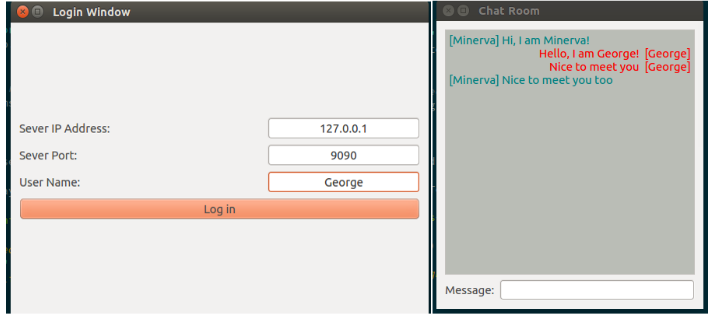

# 基于QT的多人聊天服务器

[](https://travis-ci.org/linyacool/WebServer) [](https://opensource.org/licenses/MIT)

## Introduction

本项目主要使用了C++11编写了一个简易的聊天室服务器，实现了多用户同时在线实时聊天的功能

## Enviroment

- OS: Ubuntu 16.04
- Complier: g++ 5.4.0
- Tools: VScode and Qt

## 技术要点

* epoll
* 线程池
* 客户端qt

## Build

``````bash
g++ -I. -g -std=c++11 chatserver.cpp -o server.out -lpthread
``````

## Usage

``````bash
./server.out 127.0.0.1 9090
``````

> 客户端主要利用Qt编写，使用Qt加载项目打开即可，其主要运行界面如下图所示：



