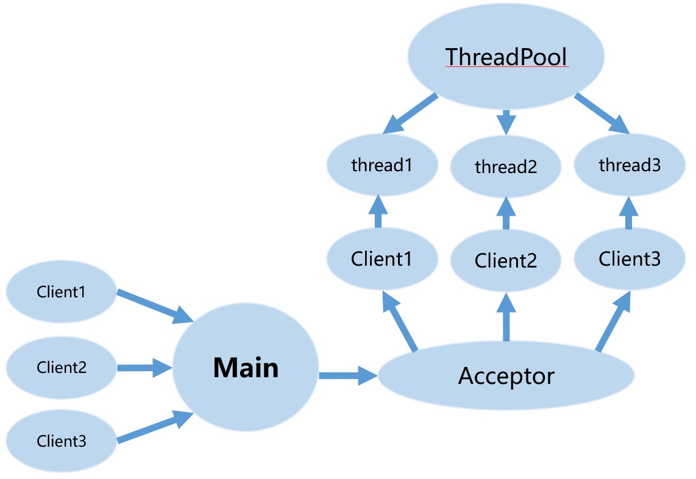
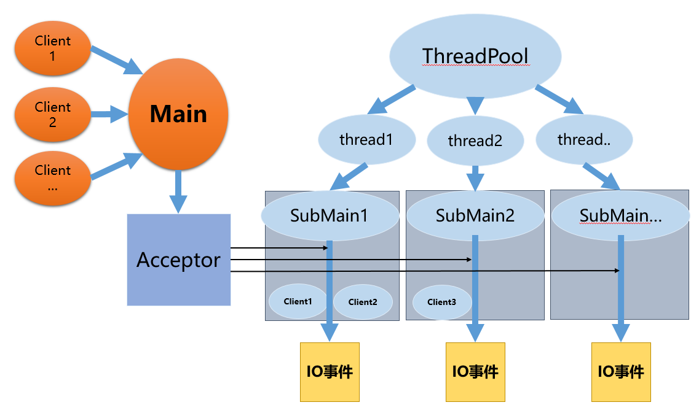

# WebServer Architecture Guide

## 1. 先用一句话理解当前这套代码

当前分支上的 WebServer 是一套基于 Reactor 模式的多线程网络服务器，同时已经做了一轮“策略层收敛”：

- 主线程负责监听和接受连接
- I/O 线程负责连接读写和回调执行
- HTTP 层负责请求解析、响应拼装和静态文件服务
- 编译期开关不再直接大面积渗透到业务层，而是尽量收敛到配置层和策略层

这套代码的核心价值不只是“能跑 HTTP”，而是把以下几件事放在了同一套工程里：

- Reactor 事件循环
- 多线程 I/O 分发
- LT / ET 模式切换
- LinearBuffer / RingBuffer 切换
- lock-free / mutex / spinlock 切换
- 连接复用
- 异步文件日志

## 2. 架构全景图

先看整体结构，再看源码。



结合当前源码，可以把模块关系压缩成下面这张文字图：

```text
runHttpServer.cpp
  |
  +-- EventLoop                         主线程 Reactor
  |
  +-- HttpServer                       HTTP 语义层
        |
        +-- TcpServer                  TCP 总控
              |
              +-- Acceptor             监听与 accept
              +-- EventLoopThreadPool  I/O 线程池
              +-- TcpConnection        单连接读写状态机
                      |
                      +-- Buffer / RingBuffer
                      +-- HttpContext
                              |
                              +-- HttpRequest
                              +-- HttpResponse
                              +-- StaticFileCache

EventLoop
  |
  +-- EventManager(epoll)
        |
        +-- Channel 分发
              |
              +-- Acceptor::handleRead()
              +-- TcpConnection::handleRead()
              +-- TcpConnection::handleWrite()
```

如果只记住一条主链路，记下面这个：

```text
main
  -> EventLoop
  -> HttpServer
  -> TcpServer
  -> TcpConnection
  -> HttpContext
  -> HttpResponse
```

## 3. 目录结构与职责划分

`webserver/` 的目录可以按“控制流自上而下、能力层自下而上”来理解：

| 目录 | 主要职责 | 代表文件 |
| --- | --- | --- |
| `loop/` | 事件循环、线程唤醒、loop 线程封装 | `KEventLoop.*`、`KAsyncWaker.*`、`KEventLoopThread.*`、`KEventLoopThreadPool.*` |
| `poller/` | epoll 封装、事件更新与分发 | `KEventManager.*`、`KChannel.*` |
| `tcp/` | socket、accept、连接管理、buffer、I/O 模式、连接回收策略 | `KAcceptor.*`、`KTcpServer.*`、`KTcpConnection.*`、`KTcpIoMode.h` |
| `http/` | HTTP 请求解析、响应构建、静态文件缓存 | `KHttpContext.*`、`KHttpServer.*`、`KStaticFileCache.*` |
| `lock/` | 锁与 lock-free 队列 | `KSpinLock.h`、`KLockFreeQueue.h` |
| `thread/` | 独立线程池实验实现 | `KThreadPool.*` |
| `utils/` | 配置、回调、时间戳、日志、基础工具 | `KBuildConfig.h`、`KCallbacks.h`、`KAsyncLogger.*`、`KTypes.h` |

推荐阅读顺序：

1. [webserver/runHttpServer.cpp](../runHttpServer.cpp)
2. [webserver/http/KHttpServer.h](../http/KHttpServer.h) / [webserver/http/KHttpServer.cpp](../http/KHttpServer.cpp)
3. [webserver/tcp/KTcpServer.h](../tcp/KTcpServer.h) / [webserver/tcp/KTcpServer.cpp](../tcp/KTcpServer.cpp)
4. [webserver/tcp/KTcpConnection.h](../tcp/KTcpConnection.h) / [webserver/tcp/KTcpConnection.cpp](../tcp/KTcpConnection.cpp)
5. [webserver/loop/KEventLoop.h](../loop/KEventLoop.h) / [webserver/loop/KEventLoop.cpp](../loop/KEventLoop.cpp)
6. [webserver/poller/KEventManager.h](../poller/KEventManager.h) / [webserver/poller/KEventManager.cpp](../poller/KEventManager.cpp)
7. [webserver/http/KHttpContext.h](../http/KHttpContext.h) / [webserver/http/KHttpContext.cpp](../http/KHttpContext.cpp)
8. [webserver/tcp/KBuffer.h](../tcp/KBuffer.h) / [webserver/tcp/KRingBuffer.h](../tcp/KRingBuffer.h)

## 4. 启动阶段：程序是怎么跑起来的

入口文件是 [webserver/runHttpServer.cpp](../runHttpServer.cpp)。

它做的事情很少，但非常关键：

1. 构造主线程 `EventLoop`
2. 构造 `HttpServer`
3. 设置静态文件根目录和线程数
4. 调用 `server.start()`
5. 进入 `loop.loop()`

启动路径如下：

```text
runHttpServer.cpp
  -> EventLoop loop
  -> HttpServer server(&loop, InetAddress(8888), "httpserver")
  -> server.setStaticFileRoot("webserver")
  -> server.setThreadNum(numThreads)
  -> server.start()
       -> TcpServer::start()
            -> EventLoopThreadPool::start()
            -> EventLoop::runInLoop(Acceptor::listen)
  -> loop.loop()
```

这个入口设计非常好理解：

- `main` 不写业务
- `HttpServer` 不拥有线程
- `EventLoop` 是整个系统的时间基准和调度中心

## 5. Reactor 核心：EventLoop、EventManager、Channel

这三个对象共同决定“事件通知 -> 事件分发 -> 回调执行”的骨架。

### 5.1 EventLoop

文件：

- [webserver/loop/KEventLoop.h](../loop/KEventLoop.h)
- [webserver/loop/KEventLoop.cpp](../loop/KEventLoop.cpp)

职责：

- 持有当前线程的 `EventManager`
- 驱动 `epoll_wait`
- 保存活跃 `Channel`
- 执行跨线程投递进来的 functor
- 通过 `AsyncWaker` 被其他线程唤醒

它的主循环非常标准：

```text
while (!quit_) {
  activeChannels_.clear();
  pollReturnTime_ = eventmanager_->poll(..., &activeChannels_);
  for channel in activeChannels_:
    channel->handleEvent(pollReturnTime_);
  doPendingFunctors();
}
```

当前分支相对老版本的一个关键变化，是 `pendingFunctors_` 已经不再直接内嵌 lockfree/mutex/spinlock 宏分支，而是统一走：

- [webserver/loop/KPendingFunctorQueue.h](../loop/KPendingFunctorQueue.h)

这意味着 `EventLoop` 现在只关心：

- `push()`
- `consumeAll()`

而不再关心底层并发容器怎么实现。

### 5.2 EventManager

文件：

- [webserver/poller/KEventManager.h](../poller/KEventManager.h)
- [webserver/poller/KEventManager.cpp](../poller/KEventManager.cpp)

职责：

- 封装 `epoll_create1`、`epoll_wait`、`epoll_ctl`
- 管理 `fd -> Channel*` 映射
- 把内核事件填充回 `activeChannels`

可以把它理解成“epoll 的面向对象包装层”。

它不拥有 `Channel`，只保存索引关系。  
对象生命周期仍然由上层，例如：

- `Acceptor`
- `TcpConnection`

自己管理。

### 5.3 Channel

文件：

- [webserver/poller/KChannel.h](../poller/KChannel.h)
- [webserver/poller/KChannel.cpp](../poller/KChannel.cpp)

职责：

- 绑定一个 fd
- 保存自己关心的事件掩码
- 保存四类回调：
  - read
  - write
  - error
  - close
- 根据 `revents_` 分发实际回调

当前分支里，`Channel::enableEpollET()` 已经结合 [webserver/utils/KBuildConfig.h](../utils/KBuildConfig.h) 做了收口：

- 调用方可以无条件调用 `enableEpollET()`
- 如果当前是 LT 模式，它自己什么都不做

这就是“业务层不感知 `USE_EPOLL_LT`”的一个具体例子。

## 6. 线程模型：为什么是主线程 accept，I/O 线程处理连接

线程模型由这两个类承载：

- [webserver/loop/KEventLoopThread.h](../loop/KEventLoopThread.h)
- [webserver/loop/KEventLoopThreadPool.h](../loop/KEventLoopThreadPool.h)

### 6.1 EventLoopThread

它的作用不是“跑普通任务”，而是：

- 启动一个新线程
- 在新线程里构造一个 `EventLoop`
- 把这个 `EventLoop*` 返回给外层管理者

所以它本质上是“线程 + loop 绑定器”。

### 6.2 EventLoopThreadPool

职责：

- 创建多个 `EventLoopThread`
- 收集每个 I/O 线程上的 `EventLoop*`
- 用 round-robin 分发连接

因此当前模型不是“线程池里抢任务”，而是：

- 每个 I/O 线程都有自己的 loop
- 连接一旦分给某个 loop，后续事件都在该线程内处理

这天然保证了连接级线程亲和性。

## 7. 网络层：从监听到连接对象

### 7.1 InetAddress、Socket、KSocketsOps

这三者负责底层 socket 细节。

#### InetAddress

文件：

- [webserver/tcp/KInetAddress.h](../tcp/KInetAddress.h)
- [webserver/tcp/KInetAddress.cpp](../tcp/KInetAddress.cpp)

职责：

- 封装 `sockaddr_in`
- 提供 `toHostPort()` 等格式化能力

#### Socket

文件：

- [webserver/tcp/KSocket.h](../tcp/KSocket.h)
- [webserver/tcp/KSocket.cpp](../tcp/KSocket.cpp)

职责：

- 持有 fd
- 在析构时关闭 fd
- 提供 bind/listen/accept/shutdown/tcp option 封装

#### KSocketsOps

文件：

- [webserver/tcp/KSocketsOps.h](../tcp/KSocketsOps.h)
- [webserver/tcp/KSocketsOps.cpp](../tcp/KSocketsOps.cpp)

职责：

- 提供无状态系统调用包装
- 屏蔽 `sockaddr` 类型转换细节
- 统一错误处理与地址转换

### 7.2 Acceptor

文件：

- [webserver/tcp/KAcceptor.h](../tcp/KAcceptor.h)
- [webserver/tcp/KAcceptor.cpp](../tcp/KAcceptor.cpp)

职责：

- 创建监听 socket
- 创建监听 fd 对应的 `Channel`
- 在 `listen()` 时把可读事件注册进主 loop
- 在 `handleRead()` 中 accept 新连接
- 通过 `NewConnectionCallback` 把新连接继续上抛给 `TcpServer`

当前分支里，`handleRead()` 已经通过 [webserver/tcp/KTcpIoMode.h](../tcp/KTcpIoMode.h) 把 LT/ET 差异收到了 helper：

- LT 模式下每次事件只 accept 一个连接
- ET 模式下会尽量 accept 到 `EAGAIN`

业务函数本身不再直接写宏分支。

### 7.3 TcpServer

文件：

- [webserver/tcp/KTcpServer.h](../tcp/KTcpServer.h)
- [webserver/tcp/KTcpServer.cpp](../tcp/KTcpServer.cpp)

职责：

- 拥有 `Acceptor`
- 拥有 `EventLoopThreadPool`
- 管理连接 map
- 接收新连接
- 为新连接绑定回调
- 把关闭连接从 map 中移除

新连接流程：

```text
Base EventLoop
  -> Acceptor::handleRead()
      -> TcpServer::newConnection(sockfd, peerAddr)
          -> EventLoopThreadPool::getNextLoop()
          -> 选择 ioLoop
          -> 尝试从 recycler 中复用 TcpConnection
          -> 如果拿不到就新建 TcpConnection
          -> configureConnection(conn)
          -> ioLoop->runInLoop(conn->connectEstablished())
```

这里有两个当前分支的重要设计点：

1. `configureConnection()` 把连接回调绑定逻辑收口了
2. `TcpConnectionRecycler<T>` 把 `USE_RECYCLE` 从业务流程里抽走了

也就是说，`TcpServer` 现在已经不再直接感知 recycle 宏，而是只调用统一策略接口。

## 8. 连接层：TcpConnection 是整个系统的 I/O 核心

文件：

- [webserver/tcp/KTcpConnection.h](../tcp/KTcpConnection.h)
- [webserver/tcp/KTcpConnection.cpp](../tcp/KTcpConnection.cpp)

### 8.1 为什么它是 `shared_ptr`

`TcpConnection` 的生命周期是异步的：

- `TcpServer::connections_` 持有它
- 回调链会临时持有它
- `queueInLoop()` 延迟任务也可能持有它

因此它必须用 `shared_ptr`，否则很容易在关闭连接和延迟回调交叉时悬空。

### 8.2 状态机

内部状态有：

- `kConnecting`
- `kConnected`
- `kDisconnecting`
- `kDisconnected`

典型流转：

```text
kConnecting
  -> connectEstablished()
  -> kConnected
  -> shutdown()
  -> kDisconnecting
  -> handleClose()
  -> connectDestroyed()
  -> kDisconnected
```

### 8.3 读路径

读事件发生时：

```text
Channel::handleEvent()
  -> TcpConnection::handleRead()
      -> tcp_io_mode::read(inputBuffer_, fd, &savedErrno)
      -> messageCallback_(shared_from_this(), &inputBuffer_, receiveTime)
```

当前分支里，`readFd` / `readFdET` 的选择已经被 `KTcpIoMode` 收口，`handleRead()` 自身只看“读结果”和“错误处理”。

### 8.4 写路径

写路径分两层：

#### 第一层：直接写

`sendInLoop()` 会先尝试：

- `tcp_io_mode::writeDirect(fd, message)`

如果一次写完：

- 不启用可写事件
- 如果注册了 `writeCompleteCallback_`，则异步回调

如果没有写完：

- 把剩余数据 append 到 `outputBuffer_`
- 打开 `channel_->enableWriting()`

#### 第二层：事件驱动 flush

当 socket 可写时：

```text
Channel writable
  -> TcpConnection::handleWrite()
      -> tcp_io_mode::write(outputBuffer_, fd, &savedErrno)
      -> 如果 outputBuffer 清空：
           -> maybeCompleteWrite()
           -> 可能 shutdownInLoop()
```

### 8.5 零拷贝文件发送

`hpSendFile()` 用 `sendfile()` 发送文件。

实现思路：

1. 如果当前线程不是所属 loop 线程，转投 `runInLoop`
2. 记录：
   - `sendFileFd_`
   - `sendFileOffset_`
   - `sendFileRemaining_`
3. 如果输出缓冲当前为空，优先直接发文件
4. 如果没发完，则通过可写事件继续 flush

### 8.6 连接回收生命周期

当前分支新增了两个配套抽象：

- [webserver/tcp/KTcpConnectionRecycler.h](../tcp/KTcpConnectionRecycler.h)
- [webserver/tcp/KTcpConnectionLifecycle.h](../tcp/KTcpConnectionLifecycle.h)

其中：

- `TcpConnectionRecycler` 决定“连接如何回收到池里”
- `TcpConnectionLifecycle` 决定“connectDestroyed 之后是否进入 recycle 生命周期”

于是 `TcpConnection::connectDestroyed()` 变成：

```text
disable channel
remove from poller
recycleLifecycle_.afterConnectDestroyed(*this)
```

业务层不再关心 `USE_RECYCLE`。

## 9. Buffer 层：为什么有两种实现

### 9.1 LinearBuffer：`KBuffer`

文件：

- [webserver/tcp/KBuffer.h](../tcp/KBuffer.h)
- [webserver/tcp/KBuffer.cpp](../tcp/KBuffer.cpp)

特点：

- 基于 `std::vector<char>`
- 可读区天然连续
- 扩容和挪动逻辑简单

优点：

- 代码更直观
- HTTP 解析最自然

### 9.2 RingBuffer：`KRingBuffer`

文件：

- [webserver/tcp/KRingBuffer.h](../tcp/KRingBuffer.h)
- [webserver/tcp/KRingBuffer.cpp](../tcp/KRingBuffer.cpp)

特点：

- 底层是循环数组
- 可读数据可能横跨数组尾和头
- 读写常结合 `readv/writev`

优点：

- 长连接高并发下可以减少数据搬移

挑战：

- “一行数据是否连续”会影响 HTTP 解析

### 9.3 当前分支是怎么收敛 Buffer 差异的

关键文件：

- [webserver/tcp/KSelectedBuffer.h](../tcp/KSelectedBuffer.h)

它把“当前构建到底选哪种 Buffer”统一成一个入口。

同时，当前分支给两种 Buffer 补了统一能力接口，例如：

- `isReadableContiguous()`
- `isSpanContiguous()`
- `readableView()`
- `readableStringUntil()`
- `retrieveLineAndCRLF()`

这使得：

- `HttpContext::parseRequest()` 可以只保留一套状态机逻辑
- `TcpConnection::send(Buffer*)` 可以统一成“能零拷贝就零拷贝，不能就回退成字符串”

## 10. HTTP 层：从字节流到响应报文

### 10.1 HttpContext

文件：

- [webserver/http/KHttpContext.h](../http/KHttpContext.h)
- [webserver/http/KHttpContext.cpp](../http/KHttpContext.cpp)

职责：

- 持有 HTTP 请求解析状态机
- 把 `Buffer` 中的数据解析成 `HttpRequest`

解析状态：

- `kExpectRequestLine`
- `kExpectHeaders`
- `kExpectBody`
- `kGotAll`

当前分支的关键改动是：

- ringbuffer 模式下不再整段 `bufferToString()`
- 只有当一行跨环时，才做局部字符串拼接

这让 ringbuffer 路径的额外拷贝显著减少。

### 10.2 HttpRequest

文件：

- [webserver/http/KHttpRequest.h](../http/KHttpRequest.h)

职责：

- 存储 method/version/path/query/headers/receiveTime

这是一个标准值对象，逻辑简单但非常重要，因为它决定了应用层回调看到的数据结构。

### 10.3 HttpResponse

文件：

- [webserver/http/KHttpResponse.h](../http/KHttpResponse.h)
- [webserver/http/KHttpResponse.cpp](../http/KHttpResponse.cpp)

职责：

- 保存状态码、头、body、文件大小等响应元数据
- 把响应序列化进 `Buffer`

### 10.4 StaticFileCache

文件：

- [webserver/http/KStaticFileCache.h](../http/KStaticFileCache.h)
- [webserver/http/KStaticFileCache.cpp](../http/KStaticFileCache.cpp)

职责：

- 维护静态文件缓存
- 做 root 目录配置和路径归一化
- 缓存：
  - 文件路径
  - content type
  - 文件大小
  - 打开的 fd

它把静态文件服务从“直接 open/stat/close”提升成了“带缓存的服务能力”。

### 10.5 HttpServer

文件：

- [webserver/http/KHttpServer.h](../http/KHttpServer.h)
- [webserver/http/KHttpServer.cpp](../http/KHttpServer.cpp)

职责：

- 把 HTTP 语义挂接到 `TcpServer`
- 在连接建立时创建 `HttpContext`
- 在收到消息时触发 `HttpContext::parseRequest()`
- 在请求完成时生成 `HttpResponse`
- 对 `/file` 使用 `StaticFileCache + sendfile`

当前默认路由包括：

- `/`
- `/hello`
- `/good`
- `/favicon.ico`
- `/file`

其中 `/file` 的处理链路最值得看，因为它把：

- 文件缓存
- 响应头写入
- 零拷贝文件发送

这三部分串到了同一个请求路径里。

## 11. 新增策略层：当前分支和原始实现最大的差异

当前分支最值得注意的，不只是“增加了什么功能”，而是“多了哪些抽象层”。

### 11.1 配置层：`KBuildConfig`

文件：

- [webserver/utils/KBuildConfig.h](../utils/KBuildConfig.h)

作用：

- 把宏收敛成：
  - `kEnableConnectionRecycle`
  - `kUseEpollLT`
  - `kUseRingBuffer`

### 11.2 并发策略层：`KPendingFunctorQueue`

文件：

- [webserver/loop/KPendingFunctorQueue.h](../loop/KPendingFunctorQueue.h)

作用：

- 用统一接口隐藏：
  - lock-free 队列
  - `std::mutex`
  - `SpinLock`

### 11.3 IO 模式策略层：`KTcpIoMode`

文件：

- [webserver/tcp/KTcpIoMode.h](../tcp/KTcpIoMode.h)

作用：

- 用 helper 隐藏 LT/ET 差异

### 11.4 生命周期策略层：`TcpConnectionRecycler / Lifecycle`

文件：

- [webserver/tcp/KTcpConnectionRecycler.h](../tcp/KTcpConnectionRecycler.h)
- [webserver/tcp/KTcpConnectionLifecycle.h](../tcp/KTcpConnectionLifecycle.h)

作用：

- 把连接回收和连接销毁行为从 `TcpServer/TcpConnection` 主逻辑里抽离

### 11.5 Buffer 选择层：`KSelectedBuffer`

文件：

- [webserver/tcp/KSelectedBuffer.h](../tcp/KSelectedBuffer.h)

作用：

- 统一选择当前 Buffer 类型
- 减少上层 include 和宏分叉

## 12. 一张“当前代码设计哲学”总结图



如果结合当前源码来重述这张图，可以概括成：

```text
控制流:
  main -> EventLoop -> EventManager -> Channel -> 回调

业务流:
  Acceptor -> TcpServer -> TcpConnection -> HttpServer -> HttpContext/Response

策略流:
  KBuildConfig
    -> KPendingFunctorQueue
    -> KTcpIoMode
    -> KSelectedBuffer
    -> TcpConnectionRecycler/Lifecycle
    -> KAsyncLogger
```

也就是说，当前分支已经把代码分成了三层：

1. 控制流层：事件循环和分发
2. 业务流层：TCP/HTTP 服务逻辑
3. 策略层：编译期开关对应的行为差异

## 13. 为什么这套设计更容易维护

和早期“宏直接散在业务逻辑里”的写法相比，当前分支的优势在于：

- 主链路类更短
- 配置影响半径更可控
- 回归测试矩阵更清晰
- 以后继续加新策略时，更容易找到落点

举一个最直观的例子：

以前要理解 `TcpConnection::handleRead()`，你需要同时思考：

- LT / ET
- ringbuffer / linear buffer
- recycle on / off

现在至少 LT / ET 这层已经通过 `KTcpIoMode` 收起来了，ringbuffer 上层差异也显著减少了。

## 14. 当前仍然可以继续优化的地方

虽然这条分支已经做了一轮很有价值的收敛，但还有几件事可以继续推进：

1. 把底层 `Buffer` / `RingBuffer` 从“同名类 + 选头”升级成真正的 `LinearBuffer/RingBuffer`
2. 进一步拆小 `HttpContext::parseRequest()`
3. 给策略组合补自动化构建矩阵
4. 把顶层 README 再收口，减少和 `docs/` 的重叠

## 15. 总结

如果只用一句话总结当前这套代码的架构特点：

> 它仍然是一套清晰的 Reactor/TCP/HTTP 三层服务器，但相比原始实现，已经开始从“宏驱动业务”转向“配置层 + 策略层驱动业务”。

这正是当前分支最值得记录的地方，也是后续继续演进的基础。
